# Documentation/Assets/Asset-Dependency-Graph.md

# Asset Dependency Graph

This document highlights similar owned assets, complementary options, and Tier 1 evaluation order.

## Tier 1 Evaluation Order

Evaluate these assets before writing custom code for overlapping problem domains:

1. **Dungeon Architect** (WORLD-001) — World Generation / Procedural Generation (Prototype Candidate)
2. **JU TPS 3 - Third Person Shooter GameKit + Vehicle Physics** (GAME-002) — Gameplay Systems / Character Controller (Core Candidate)
3. **Modular Game UI Kit** (UI-001) — UI / UI Kit (Production Candidate)
4. **Motion Matching for Unity** (ANIM-001) — Animation / Character Animation (Production Candidate)
5. **PUN 2 - FREE** (NET-001) — Networking / Multiplayer (Production Candidate)
6. **Space Graphics Toolkit** (WORLD-002) — World Generation / Level Design (Production Candidate)
7. **Starter Assets - ThirdPerson | URP** (GAME-003) — Gameplay Systems / Character Controller (Core Candidate)
8. **TopDown Engine** (GAME-004) — Gameplay Systems / Character Controller (Core Candidate)
9. **Vault Inventory** (GAME-001) — Gameplay Systems / Inventory (Core Candidate)

## Similar Assets

### Animation / Character Animation

- Frank Assassin (ANIM-010)
- Frank Dual Sword (ANIM-008)
- Frank RPG Archer (ANIM-011)
- Frank RPG Fighter (ANIM-007)
- Frank RPG Mage (ANIM-009)
- Frank Warrior (+UE FBX) (ANIM-012)
- Giant Golem AnimSet (ANIM-006)
- Human Basic Motions (ANIM-004)
- Low Poly Animated Fantasy Creatures (ANIM-003)
- Motion Matching for Unity (ANIM-001)
- Realistic Eye Movements (ANIM-005)

### Characters / Character Pack

- BerserkerS2: Mage and Archer (CHAR-010)
- FREE Starter Pack - Sidekick Modular Characters by Synty (CHAR-003)
- FurryS3: The Pirates (CHAR-005)
- Futuristic Soldier Pack (CHAR-011)
- Orc Tarkoman (CHAR-012)
- PBR Fighters (Pack) (CHAR-007)
- PP801 Character P3 (CHAR-009)
- Robot Soldier Low-poly 3D model (CHAR-013)
- Rock and Boulders 3 (CHAR-004)
- Stylized Fantasy Warrior Outfit (CHAR-001)
- Stylized Medieval Ranger Outfit (CHAR-002)
- Vikings pack (CHAR-008)
- Warrior with an axe - 2 (CHAR-006)
- Wizard Melius (CHAR-014)

### Editor Tools / Productivity

- Build for iOS/macOS on Windows (EDIT-003)
- Easy Decal (EDIT-006)
- MonKey - Productivity Commands (EDIT-007)
- Performance Tools (EDIT-004)
- Skinned Mesh Transfer (EDIT-002)
- Support package for Hovl Studio assets (EDIT-008)

### Environment / General

- Abandoned Factory (Factory, Warehouse, Industrial Factory, Industrial Warehouse) (ENV-010)
- Ancient Desert Ruins Environment (ENV-027)
- Asian Dynasty Environment (ENV-035)
- Baghdad - Medieval Islamic City Modular Environment Pack (ENV-001)
- Bio Horror / Sci-fi Environment (ENV-034)
- Brutalist (Built-In) (ENV-053)
- Cartoon Town and Farm (ENV-042)
- CUBE - Sci Fi Interiors Pack (ENV-046)
- Fantasy Slavic Hut Environment (Stylized, House, Medieval ) (ENV-025)
- Glimvale: Stylized Fantasy Open World (Modular Medieval Town, Medieval Village) (ENV-022)
- Jungle - Tropical Vegetation (ENV-055)
- Medieval Nordic Village Environment (ENV-026)
- Modular Castle & Dungeon (Medieval Castle, Castles, Dungeons, Dungeon, Castle) (ENV-013)
- Modular Dark Fantasy Graveyard (Cemetery, Horror Cemetery, Horror Graveyard) (ENV-014)
- Modular Destroyed Buildings (Modular House, Houses, Modular Building) (ENV-003)
- Modular Dungeon - Dungeon Building Kit (Dungeon, Dungeons, Catacomb, Tunnels) (ENV-012)
- Modular Dungeon: Temple Of Cthulhu (Dungeon, Modular Dungeon, Temple, Dungeons) (ENV-008)
- Modular Haunted House (Modular House, Modular Building, Barn, Haunted House) (ENV-021)
- Modular Medieval Bandit Village (Medieval Village, Bandit village, Town) (ENV-023)
- Modular Medieval Fantasy Village (Medieval Village, Medieval Town, Town) (ENV-007)
- Modular Medieval Town (Medieval Town, Medieval Village) (ENV-006)
- Modular Medieval Town (Medieval Town, Medieval Village, Modular Town, Camp) (ENV-018)
- Modular Medieval Town - Medieval Town (ENV-015)
- Modular Medieval Town, Docks (Medieval Town, Medieval Village, Town, Village) (ENV-020)
- Modular Sci Fi Outpost (Sci Fi Outpost, Sci Fi Base, Sci Fi , Outpost, Base) (ENV-016)
- Multistory Dungeons (ENV-047)
- Orbital Base Environment (Sci-Fi Space) (ENV-033)
- PBR Rocks - Nature Pack (ENV-054)
- Persepolis Empire Environment (ENV-028)
- Post Apocalyptic Town (Town, Modular Town, Post Apocalypse, Sci-Fi, Wasteland) (ENV-017)
- Retro Pop Art Living Space Environment (ENV-031)
- Sci-Fi base (ENV-052)
- SciFi Engineer's Room Environment (ENV-029)
- Stylized Fantasy Medieval Bundle (ENV-002)
- Stylized Nature (Nature, Forest, Stylized Forest, Forest Pack, Nature Pack) (ENV-005)
- Sundown:Shop/Store (Modular Shop, Supermarket, Convenience Store) (ENV-011)
- Top-Down Assets (ENV-037)
- Top-Down Caves (ENV-036)
- Top-Down City (ENV-040)
- Top-Down Desert (ENV-043)
- Top-Down Dungeons (ENV-039)
- Top-Down Graveyard (ENV-044)
- Top-Down Interiors (ENV-041)
- Top-Down Sci-Fi (ENV-038)
- Tower Defense and MOBA (ENV-045)
- Victorian Mansion Environment (ENV-030)
- Western Desert Town Environment (ENV-032)
- Whispering Grove Environment (ENV-024)

### Environment / Medieval

- Medieval Furniture Props (Gothic Props, Victorian Props, Medieval, Furniture) (ENV-004)
- Modular Wooden Buildings (Modular House, Houses, Modular Building) (ENV-019)

### Environment / Sci-Fi

- PBR Sci-Fi Floors textures (ENV-050)
- Sci-Fi Turret Constructor (ENV-051)
- Ultimate Sci-Fi Panel Materials (ENV-049)

### Gameplay Systems / Character Controller

- JU TPS 3 - Third Person Shooter GameKit + Vehicle Physics (GAME-002)
- Starter Assets - ThirdPerson | URP (GAME-003)
- TopDown Engine (GAME-004)

### Networking / Multiplayer

- Auto-Battle Framework (NET-002)
- PUN 2 - FREE (NET-001)

### Terrain / Terrain Tools

- Digger PRO – Voxel Terrain Sculpting (TERR-001)
- Terrain Grid System (TERR-002)
- Terrain PBR textures VOL 1 (TERR-004)
- Terrain PBR textures VOL 2 (TERR-005)
- Terrain PBR textures VOL3 (TERR-003)

### UI / Icons

- 500 Resource Icons (UI-004)
- Flat Icons Megapack (UI-006)

### UI / UI Kit

- Better UI (UI-003)
- EnhancedScroller (UI-002)
- Modular Game UI Kit (UI-001)
- RPG & MMO UI X (UI-005)

### Utilities / General

- AllSky - 220+ Sky / Skybox Set (UTIL-004)
- Easy ML Kit - Mobile (for iOS & Android) - Barcode Scanner, OCR, Digital Ink (UTIL-001)
- Pixul Photo Mode (UTIL-002)
- Realistic Grenades Pack (UTIL-003)
- Sky Series Collection (UTIL-005)

### VFX / Combat VFX

- 3D Fire and Explosions (VFX-012)
- Unique Shields & Barriers Vol.1 (VFX-005)
- Unique Stylized Explosions - Vol. 1 (VFX-004)
- Unique Thrusters Vol.1 (VFX-008)

### VFX / General VFX

- AAA Projectiles Vol.2 (VFX-017)
- Epic Toon FX (VFX-018)
- Fantastic Cartoon VFX (VFX-015)
- Hyper Casual FX Pack Vol.1 (VFX-009)
- Magic Arsenal (VFX-016)
- Magic Circles and Shields Vol.4 (VFX-014)
- Master Stylized FX (VFX-010)
- MudBun: Volumetric VFX & Modeling (VFX-011)
- Realistic Effects Pack 3 (VFX-020)
- RPG VFX Bundle (VFX-021)
- Spells Pack (VFX-019)
- Stylized Melee Pack 1 (VFX-013)
- Unique AoE Magic Abilities Vol. 1 (VFX-001)
- Unique Projectiles Vol. 2 (VFX-007)
- Unique Projectiles Vol. 3 (VFX-002)
- VFX Graph - Hits & Impacts - Vol. 2 (VFX-003)
- VFX Graph - Stylized Laser Beams - Vol. 1 (VFX-006)

## Competing Assets

### Gameplay Systems / Character Controller

- **JU TPS 3 - Third Person Shooter GameKit + Vehicle Physics** (GAME-002) — Core Candidate
- **Starter Assets - ThirdPerson | URP** (GAME-003) — Core Candidate
- **TopDown Engine** (GAME-004) — Core Candidate

### Networking / Multiplayer

- **Auto-Battle Framework** (NET-002) — Prototype Candidate
- **PUN 2 - FREE** (NET-001) — Production Candidate

### UI / Icons

- **500 Resource Icons** (UI-004) — Prototype Candidate
- **Flat Icons Megapack** (UI-006) — Prototype Candidate

### UI / UI Kit

- **Better UI** (UI-003) — Prototype Candidate
- **EnhancedScroller** (UI-002) — Prototype Candidate
- **Modular Game UI Kit** (UI-001) — Production Candidate
- **RPG & MMO UI X** (UI-005) — Prototype Candidate

## Complementary Assets

### Gameplay Systems / Inventory + UI / UI Kit

- Primary: Vault Inventory (GAME-001)
- Supporting: Better UI (UI-003)

### Gameplay Systems / Character Controller + Animation / Character Animation

- Primary: JU TPS 3 - Third Person Shooter GameKit + Vehicle Physics (GAME-002)
- Supporting: Frank Assassin (ANIM-010)

### World Generation / Procedural Generation + Environment / Fantasy

- Primary: Dungeon Architect (WORLD-001)
- Supporting: Modular Houses (Modular Medieval Houses, House, Fantasy Houses, Prefab Houses) (ENV-009)

## Overlap Graph

```mermaid
flowchart TD
    group1["Animation / Character Animation"]
    asset1_0["Frank Assassin"] --> group1
    asset1_1["Frank Dual Sword"] --> group1
    asset1_2["Frank RPG Archer"] --> group1
    asset1_3["Frank RPG Fighter"] --> group1
    asset1_4["Frank RPG Mage"] --> group1
    group4["Characters / Character Pack"]
    asset4_0["BerserkerS2: Mage and Archer"] --> group4
    asset4_1["FREE Starter Pack - Sidekick Modular Characters by Synty"] --> group4
    asset4_2["FurryS3: The Pirates"] --> group4
    asset4_3["Futuristic Soldier Pack"] --> group4
    asset4_4["Orc Tarkoman"] --> group4
    group6["Editor Tools / Productivity"]
    asset6_0["Build for iOS/macOS on Windows"] --> group6
    asset6_1["Easy Decal"] --> group6
    asset6_2["MonKey - Productivity Commands"] --> group6
    asset6_3["Performance Tools"] --> group6
    asset6_4["Skinned Mesh Transfer"] --> group6
    group9["Environment / General"]
    asset9_0["Abandoned Factory (Factory, Warehouse, Industrial Factory, Industrial Warehouse)"] --> group9
    asset9_1["Ancient Desert Ruins Environment"] --> group9
    asset9_2["Asian Dynasty Environment"] --> group9
    asset9_3["Baghdad - Medieval Islamic City Modular Environment Pack"] --> group9
    asset9_4["Bio Horror / Sci-fi Environment"] --> group9
    group10["Environment / Medieval"]
    asset10_0["Medieval Furniture Props (Gothic Props, Victorian Props, Medieval, Furniture)"] --> group10
    asset10_1["Modular Wooden Buildings (Modular House, Houses, Modular Building)"] --> group10
    group12["Environment / Sci-Fi"]
    asset12_0["PBR Sci-Fi Floors textures"] --> group12
    asset12_1["Sci-Fi Turret Constructor"] --> group12
    asset12_2["Ultimate Sci-Fi Panel Materials"] --> group12
    group13["Gameplay Systems / Character Controller"]
    asset13_0["JU TPS 3 - Third Person Shooter GameKit + Vehicle Physics"] --> group13
    asset13_1["Starter Assets - ThirdPerson | URP"] --> group13
    asset13_2["TopDown Engine"] --> group13
    group16["Networking / Multiplayer"]
    asset16_0["Auto-Battle Framework"] --> group16
    asset16_1["PUN 2 - FREE"] --> group16
    group19["Terrain / Terrain Tools"]
    asset19_0["Digger PRO – Voxel Terrain Sculpting"] --> group19
    asset19_1["Terrain Grid System"] --> group19
    asset19_2["Terrain PBR textures VOL 1"] --> group19
    asset19_3["Terrain PBR textures VOL 2"] --> group19
    asset19_4["Terrain PBR textures VOL3"] --> group19
    group20["UI / Icons"]
    asset20_0["500 Resource Icons"] --> group20
    asset20_1["Flat Icons Megapack"] --> group20
    group21["UI / UI Kit"]
    asset21_0["Better UI"] --> group21
    asset21_1["EnhancedScroller"] --> group21
    asset21_2["Modular Game UI Kit"] --> group21
    asset21_3["RPG & MMO UI X"] --> group21
    group22["Utilities / General"]
    asset22_0["AllSky - 220+ Sky / Skybox Set"] --> group22
    asset22_1["Easy ML Kit - Mobile (for iOS & Android) - Barcode Scanner, OCR, Digital Ink"] --> group22
    asset22_2["Pixul Photo Mode"] --> group22
    asset22_3["Realistic Grenades Pack"] --> group22
    asset22_4["Sky Series Collection"] --> group22
    group23["VFX / Combat VFX"]
    asset23_0["3D Fire and Explosions"] --> group23
    asset23_1["Unique Shields & Barriers Vol.1"] --> group23
    asset23_2["Unique Stylized Explosions - Vol. 1"] --> group23
    asset23_3["Unique Thrusters Vol.1"] --> group23
    group24["VFX / General VFX"]
    asset24_0["AAA Projectiles Vol.2"] --> group24
    asset24_1["Epic Toon FX"] --> group24
    asset24_2["Fantastic Cartoon VFX"] --> group24
    asset24_3["Hyper Casual FX Pack Vol.1"] --> group24
    asset24_4["Magic Arsenal"] --> group24
```

